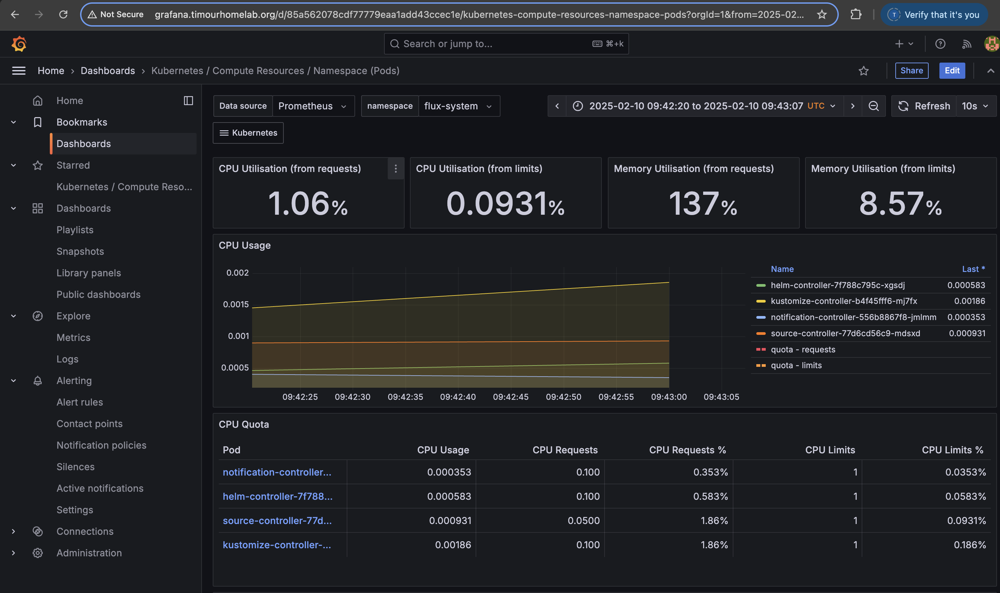

# Self Hosted Cluster – GitOps

This repository contains the configuration for operating a self-hosted k3s Kubernetes cluster on Raspberry Pis managed through a GitOps workflow. The setup utilizes Flux, Kustomize, SOPS, and Cloudflared, with integrated monitoring via Prometheus and Grafana and automated image updates using Renovate.

## Features

- **k3s Cluster:** Self-hosted Kubernetes on Raspberry Pis
- **GitOps:** Declarative cluster management using Flux, Kustomize, and SOPS for secure secret handling
- **Secure Tunneling:** Cloudflared provides secure external access to internal services
- **Monitoring:** Integration of Prometheus and Grafana for cluster and application monitoring
- **Automated Updates:** Renovate automatically updates container images
- **Differentiated Environments:** Separate base configurations and overlays (e.g., staging)

## Live Applications on this Cluster

- **Audiobooks Application:** Access the audiobooks app at [https://audiobooks.timourhomelab.org/login/](https://audiobooks.timourhomelab.org/login/)
- **Linkding Instance:** Check out the linkding-based bookmarking service at [https://ldpi.timourhomelab.org/](https://ldpi.timourhomelab.org/)

## Grafana Monitoring

## TO DO

- Extend the single-node k3s cluster to a multi-node cluster by integrating additional worker nodes.
- Kubernetes cluster scaling & optimization.
- Integrate a cloud-native Postgres deployment.
