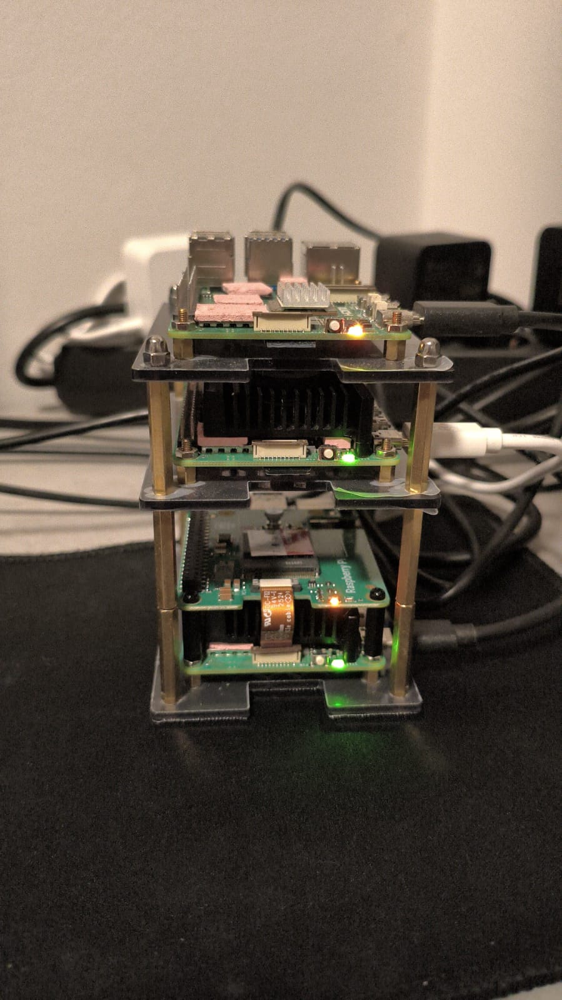

# 🏠 Homelab

[Homepage](http://homepage.timourhomelab.org)

## Introduction

This repo contains all of the configuration and documentation of my homelab.

The purpose of my homelab is to learn and to have fun. Being a Cloud Native Engineer by trade, I work with Kubernetes every day, and my homelab is the place where I can try out and learn new things. On the other hand, by self-hosting some applications, it makes me feel responsible for the entire process of deploying and maintaining an application from A to Z. It forces me to think about backup strategies, security, scalability and the ease of deployment and maintenance.

## Cluster Provisioning & Architecture

I use [K3s](https://k3s.io/) to set up my cluster. I prefer K3s because it is lightweight and minimal, optimized for edge and IoT environments while still providing production-grade capabilities.

## :computer: Hardware

### Nodes

I use Raspberry Pi computers for my cluster, which offer great performance in a small form factor with minimal power consumption.

Raspberry Pi 5 Model B 8GB RAM (Master Node)
Raspberry Pi 5 Model B 8GB RAM (Worker Node)
Raspberry Pi 5 Model B 16GB RAM (Worker Node)

## :rocket: Installed Apps & Tools

### Apps

End User Applications

<table>
    <tr>
        <th>Logo</th>
        <th>Name</th>
        <th>Description</th>
    </tr>
    <tr>
        <td></td>
        <td><a href="https://github.com/sissbruecker/linkding">Linkding</a></td>
        <td>Self-hosted bookmark manager with browser extensions</td>
    </tr>
    <tr>
        <td></td>
        <td><a href="https://www.audiobookshelf.org/">Audiobookshelf</a></td>
        <td>Self-hosted audiobook and podcast server</td>
    </tr>
    <tr>
        <td></td>
        <td><a href="https://www.pgadmin.org/">pgAdmin</a></td>
        <td>Web-based PostgreSQL database management tool with credentials securely fetched from AWS Secrets Manager</td>
    </tr>
    <tr>
    <td></td>
    <td><a href="https://github.com/gethomepage/homepage">Homepage</a></td>
    <td>A modern dashboard for self-hosted applications</td>
</tr>
</table>

### Infrastructure

Everything needed to run my cluster & deploy my applications

<table>
    <tr>
        <th>Logo</th>
        <th>Name</th>
        <th>Description</th>
    </tr>
    <tr>
        <td></td>
        <td><a href="https://cilium.io/">Cilium</a></td>
        <td>eBPF-based networking, observability and security for Kubernetes</td>
    </tr>
    <tr>
        <td></td>
        <td><a href="https://developers.cloudflare.com/cloudflare-one/">Cloudflare Zero Trust</a></td>
        <td>Used for private tunnels to expose public services (without requiring a public IP).</td>
    </tr>
      <tr>
        <td></td>
        <td><a href="https://cert-manager.io/">Cert Manager</a></td>
        <td>X.509 certificate management for Kubernetes with Let's Encrypt integration</td>
    </tr>
    <tr>
        <td></td>
        <td><a href="https://cloudnative-pg.io/">CloudNativePG</a></td>
        <td>Database operator for running PostgreSQL clusters with AWS S3 backups</td>
    </tr>
    <tr>
        <td></td>
        <td><a href="https://fluxcd.io/">Flux CD</a></td>
        <td>My GitOps solution of choice for managing cluster resources</td>
    </tr>
    <tr>
        <td></td>
        <td><a href="https://grafana.com/">Grafana</a></td>
        <td>The open observability platform</td>
    </tr>
    <tr>
        <td></td>
        <td><a href="https://prometheus.io/">Prometheus</a></td>
        <td>An open-source monitoring system with a dimensional data model, flexible query language, efficient time series database and modern alerting approach</td>
    </tr>
    <tr>
        <td></td>
        <td><a href="https://github.com/renovatebot/renovate">Renovate</a></td>
        <td>Automated dependency updates</td>
    </tr>
    <tr>
        <td></td>
        <td><a href="https://aws.amazon.com/s3/">AWS S3</a></td>
        <td>Cloud object storage for database backups and disaster recovery</td>
    </tr>
    <tr>
        <td></td>
        <td><a href="https://external-secrets.io/">External Secrets Operator</a></td>
        <td>Kubernetes operator that integrates external secret management systems like AWS Secrets Manager</td>
    </tr>
    <tr>
        <td></td>
        <td><a href="https://aws.amazon.com/secrets-manager/">AWS Secrets Manager</a></td>
        <td>Centralized cloud-based secrets management service for storing and retrieving application credentials</td>
    </tr>
    <tr>
        <td></td>
        <td><a href="https://www.elastic.co/">Elasticsearch</a></td>
        <td>Search engine and analytics</td>
    </tr>
</table>

## Cluster Management Interface

My homelab is orchestrated using a combination of GitOps tools that ensure all configurations remain declarative and consistent. I use Flux CD for continuous deployment and Renovate for automated dependency updates. This central interface, accessible via [Homepage](http://homepage.timourhomelab.org), provides a complete overview of cluster health, installed apps, and infrastructure status.

## Networking

I use [K3s](https://k3s.io/) with its built-in networking capabilities, which provides a simple yet powerful solution for container networking.

### Storage

My storage strategy revolves around persistent volumes managed by K3s with local paths. For backups, I use CloudNativePG's integration with AWS S3 to ensure data durability.

## Secret Management

I use a multi-layered approach to secret management:

1. **AWS Secrets Manager** - Stores sensitive credentials like database passwords and service access keys
2. **External Secrets Operator** - Pulls secrets from AWS Secrets Manager and creates corresponding Kubernetes secrets
3. **SOPS** - Encrypts sensitive configuration files directly in the Git repository
4. **Flux** - Handles decryption of SOPS-encrypted files during GitOps operations

#
